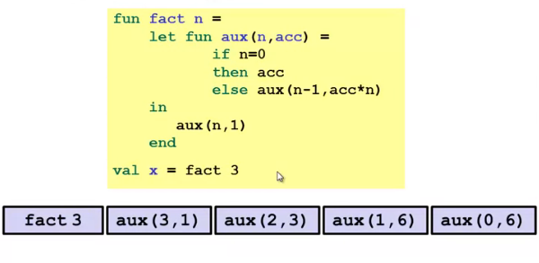

### ML Variable Bindings and Expressions

```sml
val z = 3;
(* static environment: z : int *)
(* dynamic environment: z --> 3 *)

val w = z + 1;
(* static environment: z : int, w : int *)
(* dynamic environment: z --> 3, w --> 4 *)
```

1. The semantics
- Syntax is just how you write something
- Semantics is what something means
  - Type-checking (before program runs)
  - Evaluation (as program runs)
- For variable bindings:
  - Type-check expression and extend static environment 
  - Evaluate expression and extend dynamic environment

2. Rules for expressions:
- Every kind of expression has:
  - Syntax 
  - Type-checking rules. Produce a type or fails.
  - Evaluation rules (used only on things that type-check).  
    Produce a value (or exception or infinite-loop).

3. Reasons for shadowing:
```sml
val a = 1
val b = a (* b is bound to 1 *)
val a = 2
```
- Expressions in variable bindings are evaluated **eagerly**
  - Before the variable binding finishes
  - Afterwards, the expression producing the value is irrelevant
- There is no way to assign to a variable in ML
  - Can only shadow in a later environment  

### ML Functions

1. Functions informally
```sml
fun pow (x : int, y : int) = 
  if y = 0 
  then 1
  else x * pow (x, y - 1)
```
- Cannot refer to later function bindings
  - Simply ML`s rule
  - Helper functions must come before their uses
  - Need special construct for mutual recursion 

2. Function bindings formally
- Syntax: `fun x0 (x1 : t1, ..., xn : tn) = e`
- Type-checking: 
  - Add binding `x0 : (t1 * ... * tn) -> t` if:
  - Can type-check body `e` to have type `t` in the static environment containing:
    - Enclosing static environment (earlier bindings)
    - `x1 : t1, ..., xn : tn` (arguments with their types)
    - `x0 : (t1 * ... * tn) -> t` (for recursion) 
- Evaluation: 
  - A function is a value — we simply add x0 to the environment as a function that can be called later. 
  - As expected for recursion, x0 is in the dynamic environment in the function body and for subsequent bindings.

  
3. Function calls formally
- Syntax: `e0 (e1,...,en)` with the parentheses optional if there is exactly one argument.
- Type-checking: require that `e0` has a type that looks like `t1 * ... * tn -> t` and for 1 ≤ i ≤ n, `ei` has type `ti`. Then the whole call has type `t`.
- Evaluation:
  - Evaluate `e0` to `fun x0 (x1 : t1, ..., xn : tn) = e`. Since call type-checked, result will be a function. Evaluate arguments to values `v1, ..., vn` (Under current dynamic environment).
  - Result is evaluation of `e` in an environment extended to map `x1` to `v1, ..., xn` to `vn` (An environment is actually the environment where the function was defined, and includes `x0` for recursion).

### Pairs and Other Tuples

1. Build
- Syntax: `(e1, e2)`
- Type-checking: if `e1` has type `ta` and `e2` has type `tb`, then the pair expression has type `ta * tb` - a new kind of type.
- Evaluation: evaluate `e1` to `v1` and `e2` to `v2`, result is `(v1, v2)` - a pair of values is a value.

2. Access
- Syntax: `#1 e` and `#2 e`
- Type-checking: if `e` has type `ta * tb`, then `#1 e` has type `ta` and `#2 e` has type `tb`.
- Evaluation: evaluate `e` to a pair of values and return first or second piece.

```sml
fun swap (pr : int * bool) = 
  (#2 pr, #1 pr)

fun sum_two_pairs (pr1 : int * int, pr2 : int * int) =
  (#1 pr1) + (#2 pr1) + (#1 pr2) + (#2 pr2)

fun div_mod (x: int, y: int) =
  (x div y, x mod y)

fun sort_pair (pr : int * int) =
  if (#1 pr) < (#2 pr)
  then pr
  else (#2 pr, #1 pr)
```

3. Tuple is a generalization of pairs. 
- Pairs and tuples can be nested (implied by the syntax and semantics)

```sml
val x1 = (7, (true, 9))
val x2 = #1 (#2 x1)
```

### Lists

1. Build: `[v1, v2, ... ,vn]`, `::` pronounced **cons**
2. Access: `null`, `hd`, `tl` 
3. Functions over lists are usually recursive, only way to get to all the elements.

```sml
fun sum_list (xs : int list) =
  if null xs
  then 0
  else hd(xs) + sum_list(tl xs)
  
fun countdown (x : int) =
  if x = 0
  then []
  else x :: countdown(x - 1)

fun append (xs : int list, ys : int list) =
  if null xs
  then ys
  else (hd xs) :: append(tl xs, ys)
```

### Let Expressions

```sml
fun countup_from (x : int) =
  let 
    fun count (from : int) =
      if from = x
      then x :: []
      else from :: count (from + 1)
  in
    count (1)
  end

fun max (xs : int list) =
  if null xs
  then 0
  else if null (tl xs)
  then hd xs
  else 
    (* for style, could also use a let-binding for (hd xs) *)
    let val tl_ans = max (tl xs)
    in 
      if hd xs > tl_ans
      then hd xs
      else tl_ans
    end
```
1. Syntax: `let b1 b2 ... bn in e end`. Each `bi` is any binding and `e` is any expression.
2. Type-checking: Type-check each `bi` and `e` in a static environment that includes the previous bindings. Type of whole let-expression is the type of `e`.
3. Evaluation: Evaluate each `bi` and `e` in a dynamic environment that includes the previous bindings. Result of whole let-expression is result of evaluating `e`.
4. Scope: where a binding is in the environment. Only in later bindings and body of the let-expression.
5. The key to improve efficiency of recursion is not to do repeated work that might do repeated work. Saving recursive results in local bindings is essential.

### Options

```sml
fun max1 (xs : int list) =
  if null xs
  then NONE
  else 
    let val tl_ans = max1 (tl xs)
    in if isSome tl_ans andalso valOf tl_ans > hd xs
      then tl_ans
      else SOME (hd xs)
    end
```
1. Building: `NONE` has type `'a option`, `SOME e` has type `t option` if `e` has type `t`.
2. Accessing: `isSome` has type `'a option -> bool`, `valOf` has type `'a option -> 'a`  (exception if given `NONE`).

### Booleans and Comparison Operations

1. Syntax: `e1 andalso e2`, `e1 orelse e2`, `not e1`.
2. Short-circuiting evaluation means `andalso` and `orelse` are not functions, but `not` is just a pre-defined function.
3. `=` `<>` can be used with any equality type but not with `real`.

### No Mutation: ML vs. Imperative Languages

1. In ML, we create aliases all the time without thinking about it because it is impossible to tell where there is aliasing.
   - Example: `tl` is constant time; does not copy rest of the list.
   - So do not worry and focus on the algorithm.
2. In language with mutable data (e.g. Java), programmers are obsessed with aliasing and object identity.
   - They have to be (!) so that subsequent assignments affect the right parts of the program.
   - Often crucial to make copies in just the right places.
3. Reference (alias) vs. copy does not matter if code is immutable.

### Pieces of a Language

1. Syntax
2. Semantics (evaluation rules)
3. Idioms (typical patterns for using language features to express the computation)
4. Libraries
5. Tools

### Building Compound Types

Three most important type building-blocks in any language:
1. Each of: A `t` value contains values of each of `t1 t2 ... tn`. Such as tuples and records (idea of syntactic sugar and connection with tuples).
2. One of: A `t` value contains values of ont of `t1 t2 ... tn`. Such as option and a type that contains an int or string (will lead to pattern-matching).
3. Self reference: A `t` value can refer to other `t` values.

### Records

1. Record values have fields (any name) holding values `{f1 = v1, ... , fn = vn}`. Record types have fields holding types `{f1 : t1, ..., fn : tn}`. The order of fields in a record value of type never matters. REPL alphabetizes fields just for consistency.
2. Building records: `{f1 = e1, ..., fn = en}`
3. Accessing pieces: `#myfieldname e`
4. Evaluation rules and type-checking as expected.
5. A common decision for a construct's syntax is whether to refer to things by position (as in tuples) or by some (field) name (as with records).
   - A common hybrid is like with Java method arguments (and ML functions are used so far):
     - Caller uses position
     - Callee uses variables
     - Could do it differently
6. Tuples are just syntactic sugar for records with fields named 1, 2, ...
   - Syntactic: Can describe the semantics entirely by the corresponding record syntax.
   - They simplify understanding / implementing the langauge.

### Datatype Bindings

1. A way to make one-of types: 
   - A `datatype` binding
  ```sml
  datatype mytype = 
    TwoInts of int * int
    | Str of string
    | Pizza
  ```
  - Adds a new type `mytype` to the environment
  - Adds constructors to the environment: `TwoInts`, `Str` and `Pizza`
    - `TwoInts : int * int -> mytype`
    - `Str : string -> mytype`
    - `Pizza : mytype`
2. A constructor is (among other things), a **function** that makes values of the new type (or is a value of the new type):
  - Any value of type `mytype` is made from one of the constructors.
  - The value contains:
    - A tag for which constructor (e.g. TwoInts)
    - The corresponding data (e.g. (7, 9)) 
3. In many other contexts, these datatypes are called tagged unions.
4. There are two aspects to accessing a datatype value:
   - Check what variant it is (what constructor made it). `null` and `isSome` check variants.
   - Extract the data (if that variant has any). `hd` `tl` `valOf` extract data (raise exception on wrong variant).
5. Useful datatypes:
   - Enumerations, including carrying other data.
   - Alternate ways of identifying real-world things/people.
   - Expression trees. This is an example using self-reference:
    ```sml
    datatype exp = 
      Constant of int
      | Negate of exp
      | Add of exp * exp
      | Multiply of exp * exp

    (* functions over recursive datatypes are usually recursive *)

    fun eval e = 
      case e of 
        Constant i => i
        | Negate e2 => ~ (eval e2)
        | Add (e1, e2) => (eval e1) + (eval e2)
        | Multiply (e1, e2) => (eval e1) * (eval e2)

    fun number_of_adds e = 
      case e of
        Constant i => 0
        | Negate e2 => number_of_adds e2
        | Add (e1, e2) => 1 + number_of_adds e1 + number_of_adds e2
        | Multiply (e1, e2) => number_of_adds e1 + number_of_adds e2
    ```
    - Lists and Options are datatypes.
    ```sml
    datatype my_int_list = Empty | Cons of int * my_int_list

    fun inc_or_zero intoption = 
      case intoption of
        NONE => 0
        | SOME i => i + 1

    fun append (xs, ys) =
      case xs of
        [] => ys
        | x :: xs' => x :: append (xs', ys)
    ```
6. Polymorphic Datatypes:
   - Syntax: put one or more type variables before datatype name. Can use these type variables in constructor definitions. Binding then introduces a type constructor, not a type. (Must say `int mylist`, `'a mylist`, not `mylist`).
  ```sml
  datatype 'a mylist = Empty | Cons of 'a * 'a mylist

  datatype ('a, 'b) tree = 
    Node of 'a * ('a, 'b) tree * ('a, 'b) tree
    | Leaf of 'b
  ```
  - Use constructors and case expressions as usual. No change to evaluation rules. Type-checking will make sure types are used consistently. For example, cannot mix element types of list. Functions will be polymorphic or not based on how data is used.

### Case Expressions

1. ML combines the two aspects of accessing a one-of value with a case expression and pattern-matching.

```sml
fun f (x : mytype) = 
  case x of
    Pizza => 3
    | Str s => 8
    | TwoInts (i1, i2) => i1 + i2
```

- A multi-branch conditional to pick branch based on variant.
- Extracts data and binds to variables local to that branch.
- Type-checking: all branches must have same type.
- Evaluation: evaluate between case ... of and the right branch.
- Patterns are not expressions: We do not evaluate them. We see if the result of `e0` matches them.

### Type Synonyms

1. Creating new types:
- A datatype binding introduces a new type name.
  - Distinct from all existing types.
  - Only way to create values of the new type is the constructors.
- A type synonym is a new kind of binding `type aname = t`.
  - Just creates another name for a type.
  - The type and the name are interchangeable in every way.
  - Do not worry about that REPL prints: picks what it wants just like it picks the order of record field names.
2. A convenience for talking about types. Related to modularity.

### Each of Pattern Matching

1. Pattern matching also works for records and tuples.
2. Val-binding patterns: variables are just one kind of pattern. 
3. A function argument can also be a pattern. What we call multi-argument functions are just functions taking one tuple argument, implemented with a tuple pattern in the function binding. Zero arguments is the unit pattern () matching the unit value ().

```sml
fun sum_triple triple = 
  case triple of
    (x, y, z) => x + y + z

fun sum_triple1 triple = 
  let val (x, y, z) = triple
  in
    x + y + z
  end

fun sum_triple2 (x, y, z) = x + y + z
```

### Polymorphic and Equality types

1. The **more general** rule: A type t1 is more general than the type t2 if you can take t1, replace its type variables consistently, and get t2.
- Example: replace each `'a` with `int * int`
- Example: replace each `'b` with `'a` and each `'a` with `'a`
2. Can combine the **more general** rule with rules for equivalence:
- Use of type synonyms does not matter
- Order of field names does not matter
3. Type variables with a second quote such as `''a list * ''a -> bool` are **equality types** that arise from using the = operator. The = operator works on lots of types: int, string, tuples containing all equality types... But not all types: function types, real...
4. The rules for more general are exactly the same except you have to replace an equality-type variable with a type taht can be used with =.

```sml
(* ''a * ''a -> string *)
fun same_thing (x, y) =
  if x = y then "yes" else "no"
```

### Nested Patterns

```sml
fun zip list_triple =
  case list_triple of
    ([], [], []) => []
    | (hd1 :: tl1, hd2 :: tl2, hd3 :: tl3) => 
      (hd1, hd2, hd3) :: zip (tl1, tl2, tl3)
    | _ => raise ListLengthMismatch

fun unzip lst = 
  case lst of
    [] => ([], [], [])
    | (a, b, c) :: tl => 
      let val (l1, l2, l3) = unzip tl
      in (a :: l1, b :: l2, c :: l3) end

fun multsign (x1, x2) = (* int * int -> sgn *)
  let fun sign x = if x = 0 then Z else if x > 0 then P else N
  in
    case (sign x1, sign x2) of
      (Z, _) => Z
    | (_, Z) => Z
    | (P, P) => P
    | (N, N) => P
    | (N, P) => N
    | (P, N) => N
  end
```

1. We can nest patterns as deep as we want. The full meaning of pattern matching is to compare a pattern against a value for the same shape and bind variables to the right parts.
2. A common idiom is matching against a tuple of datatypes to compare them.
3. Wildcards are good style: use them instead of variables when you do not need the data.
4. The semantics for pattern-matching takes a pattern p and a value v and decides does it match and if so what variable bindings are introduced. Since patterns can nest, the definition is elegantly recursive, with a separate rule for each kind of pattern.
5. Function patterns: syntactic sugar of case expression.

```sml
fun f p1 = e1
  | f p2 = e2
  | f pn = en

fun append ([], ys) = ys
  | append (x :: xs', ys) = x :: append (xs', ys)
```

### Exceptions

```sml
fun maxlist (xs, ex) = (* int list * exn -> int *)
  case xs of
    [] => raise ex
  | x :: [] => x
  | x :: xs' => Int.max(x, maxlist (xs', ex))

exception MyException of int * int
exception MySimpleException

val x = maxlist ([3, 4, 5], MySimpleException)
        handle MySimpleException => 0

val w = maxlist ([], MyException (2, 3))
        handle MyException (x, y) => x + y
```

1. Exceptions are a lot like datatype constructors.
2. Declaring an exception makes adds a constructor for type `exn`.
3. Can pass values of `exn` anywhere (e.g. function arguments).
4. Handle can have multiple branches with patterns for type `exn`.

### Tail Recursion

```sml
fun fact n = 
  let fun aux (n, acc) =
    if n = 0
    then acc
    else aux (n - 1, acc * n)
  in aux (n, 1) end

fun rev' xs = 
  case xs of
    [] => []
  (* append must traverse the first list *)
  | x :: xs' => (rev' xs') @ [x]

fun rev xs = 
  let fun aux (xs, acc) =
    case xs of
      [] => acc
    | x :: xs' => aux (xs', x :: acc)
  in aux (xs, []) end
```

1. While a program runs, there is a call stack of function calls that have started but not yet returned.
- Calling a function f pushes an instance of f on the stack.
- When a call to f finished, it is popped from the stack.
- These stack-frames store information like the value of local variables and what is left to do in function. Due to recursion, multiple stack-frames may be calls to the same function.
2. An optimization: It is unnecessary to keep around a stack-frame just so it can get a callee's result and return it without any further evaluaion. ML recognizes these tail calls in the compiler and treats them differently:
- Pop the caller before the call, allowing callee to reuse the same stack space (tail-calls: nothing left for caller to do, so the pop caller).
- Along with other optimizations, as efficient as a loop.

3. Accumulators for tail recursion: 
- Tail-recursive: recursive calls are tail-calls.
- A methodology that can often guide this transformation: Create a helper function that takes an accumulator. Old base case becomes initial accumulator. New base case becomes final accumulator.
4. There are certainly cases where recursive functions cannot be evaluated in a constant amount of space. Most obvious examples are functions that process trees. In these cases, the natural recursive approach is the way to go.
5. A tail call is a function call in tail position. If an expression is not in tail position, then no subexpressions are. The nothing left for caller to do intuition usually suffices.
